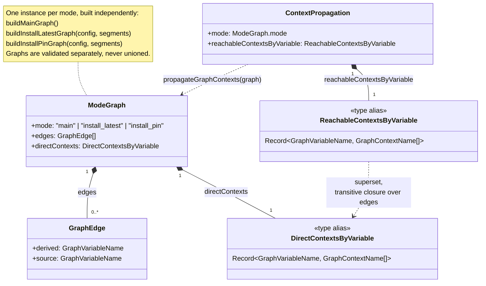
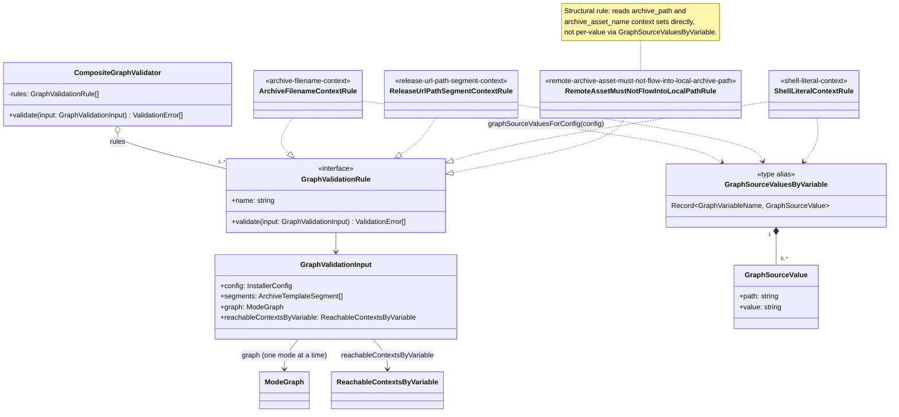

# Variable Dependency Graph And Context-Specific Validation

`installerer` validates `archive.nameTemplate` and the config fields that feed it by building a small variable dependency graph per runtime mode and propagating the _contexts_ each variable's value is used in. A fixed set of context-specific rules then checks only the config values that actually reach a dangerous context. This design was introduced to answer [issue #4](https://github.com/tooppoo/installerer/issues/4): the same value (for example a release tag) is safe in one context (a Git ref name) and unsafe in another (an archive filename), so validation must be aware of _where a value flows_, not just what type it declares.

Implementation lives in [`src/archiveTemplateValidation.ts`](../src/archiveTemplateValidation.ts).

## Modes Are Graphed Independently

The generator builds three separate graphs, one per runtime mode:

- `buildMainGraph()` — argument parsing and dispatch (`main`)
- `buildInstallLatestGraph(config, segments)` — latest-release install (`install_latest`)
- `buildInstallPinGraph(config, segments)` — pinned-version install (`install_pin`)

Each graph is validated on its own; **they are never unioned**. A context that only applies under `install_pin` (for example, a template using `{version}` while pinning) must not leak into the `install_latest` graph's validation, since `install_latest` resolves the version differently (or not from user input at all).

## Graph Model

A graph is a set of directed edges `derived ← source` (a derived variable is computed from a source variable) plus a table of the contexts each variable is _directly_ used in (`directContexts`). Propagation then computes, for every variable, every context it can _reach_ transitively through the graph (`reachableContextsByVariable`).



### Why Contexts Propagate From `derived` To `source`

`propagateGraphContexts` walks every edge and copies the **derived** variable's contexts onto the **source** variable, repeating until a fixed point. This direction matters: if `archive_asset_name` (derived) is used in `"archive filename context"`, then anything it is built from — `owner`, `repo`, `resolved_version`, etc. (sources) — must also be safe in that context, because those source values end up embedded in the asset filename. A value is only as safe as the strictest context reachable from anything it feeds into.

For example, in `install_pin`, `pinned_version` only gains `"archive filename context"` when the template actually uses `{version}` (`templateUsesPlaceholder(segments, "version")`); otherwise the version never flows into the filename and stays validated only as a Git tag / URL path segment.

## Direct Contexts By Mode

`main` declares two variables directly:

| Variable      | Direct contexts                                     |
| ------------- | --------------------------------------------------- |
| `version_arg` | `shell command argument context`, `Git tag context` |
| `dispatch`    | `argument parsing context`                          |

`install_latest` and `install_pin` share the same direct-context table (`installDirectContexts`), plus `versionResolver.fileName` when `versionResolver.type === "release_version_file"`:

| Variable                                                     | Direct contexts                                                                      |
| ------------------------------------------------------------ | ------------------------------------------------------------------------------------ |
| `archive_asset_name`                                         | `archive filename context`, `checksum lookup context`, `shell literal context`       |
| `archive_url`                                                | `Release URL context`, `shell command argument context`                              |
| `checksum_url`                                               | `Release URL context`, `shell command argument context`                              |
| `checksum_lookup_key`                                        | `checksum lookup context`                                                            |
| `checksum.fileName`                                          | `safe filename context`, `Release URL path segment context`, `shell literal context` |
| `archive_path`                                               | `local filesystem context`, `shell command argument context`                         |
| `resolved_version` (`install_latest` only)                   | `Git tag context`, `Release URL path segment context`                                |
| `pinned_version` (`install_pin` only)                        | `Git tag context`, `Release URL path segment context`                                |
| `versionResolver.fileName` (only for `release_version_file`) | `safe filename context`, `Release URL path segment context`, `shell literal context` |

Edges then connect config-derived source variables (`owner`, `repo`, `bin`, `os`, `arch`, `target`, template literal segments, and — for `install_latest` with `release_version_file` — `versionResolver.fileName` → `resolved_version`) up into `archive_asset_name`, `archive_url`, `checksum_url`, `checksum_lookup_key`, and `archive_path`. `addArchiveTemplateEdges` adds one `archive_asset_name ← <placeholder>` edge per placeholder actually present in `archive.nameTemplate`, so unused placeholders never contribute contexts.

### `asset_arch_label` (Issue #76)

`{arch}` and `{target}` do not derive `archive_asset_name` from the canonical `arch` variable directly. Instead, `architectureLabelEdges()` (called by both `buildInstallLatestGraph` and `buildInstallPinGraph`) inserts an intermediate node:

```text
{ derived: "asset_arch_label", source: "arch" }
{ derived: "asset_arch_label", source: "architectureLabels.x86_64" }
{ derived: "asset_arch_label", source: "architectureLabels.aarch64" }
```

`addArchiveTemplateEdges` then adds `{ derived: "archive_asset_name", source: "asset_arch_label" }` whenever the template uses `{arch}` or `{target}`, rather than an edge from `arch` directly. This means the two `architectureLabels.<canonical_arch>` config values — not just the canonical `arch` variable — inherit `archive_asset_name`'s contexts (`archive filename context`, `checksum lookup context`, `shell literal context`) whenever the template embeds architecture information. `graphSourceValuesForConfig` maps `architectureLabels.x86_64`/`architectureLabels.aarch64` back to `$.architectureLabels.x86_64`/`$.architectureLabels.aarch64`, so the existing `archive-filename-context` and `shell-literal-context` rules validate custom architecture labels the same way they validate `owner`, `repo`, or `checksum.fileName` — no dedicated rule was needed. This is defense in depth: `architectureLabels` values are already rejected at parse time by a dedicated `^[A-Za-z0-9._+-]+$` check (with `.`/`..` rejected explicitly) regardless of whether `{arch}`/`{target}` appear in the template at all.

## Context-Specific Validation Policy

Once contexts are propagated, a small set of rules inspects `reachableContextsByVariable` and flags real config field values (not abstract graph node names) that reach a context they cannot safely occupy. Rules run per mode graph and results are deduplicated.



`graphSourceValuesForConfig` maps graph variable names back to the actual JSON config field and its path (`owner`, `repo`, `bin`, `checksum.fileName`, `archive.nameTemplate` literal segments, and conditionally `versionResolver.fileName`), so the three per-value rules can report a real `$.`-prefixed path when they reject a value.

### Rules

- **`archive-filename-context`** — for any source whose reachable contexts include `"archive filename context"`, rejects the value if it contains a path separator, whitespace, or control character (`hasArchiveFilenameHardChars`). For the template's literal segments, only the literal characters are checked (placeholder braces are skipped).
- **`release-url-path-segment-context`** — for any source reaching `"Release URL path segment context"`, rejects control characters, since each path segment is percent-encoded independently and must be encodable as one UTF-8 segment.
- **`shell-literal-context`** — for any source reaching `"shell literal context"`, rejects NUL, since NUL cannot be represented in a POSIX shell literal or argument.
- **`remote-archive-asset-must-not-flow-into-local-archive-path`** — a structural (not per-value) rule: it fails if `archive_path` ever reaches `"archive filename context"` or `archive_asset_name` ever reaches `"local filesystem context"`. This is the enforcement of the design principle from issue #4: remote asset names and local temporary paths must stay separated. The generated runtime always builds `archive_path` from `tmpdir` and a fixed local filename, never from the remote asset name (see [Remote Asset Names And Local Paths](generated-installer-runtime.md#remote-asset-names-and-local-paths)).

Contexts declared in `directContexts` but not read by any rule today (`Git tag context`, `Release URL context`, `checksum lookup context`, `argument parsing context`, `shell command argument context`, `safe filename context`) still take part in propagation — they can carry other contexts backward through edges — but have no dedicated hard-error check yet. Adding a new context-specific policy means adding a rule that reads that context name from `reachableContextsByVariable`; it does not require changing the graph shape.

## Independent Validation, No Merge

`validateArchiveTemplateForConfig` builds all three graphs, propagates each independently, and runs the same `CompositeGraphValidator` against each mode's own `reachableContextsByVariable`. Errors are deduplicated across modes only by identical `(path, reason, expected)`, not by merging the graphs themselves — a context reachable only in `install_pin` cannot produce a false positive in `install_latest`, and vice versa.
